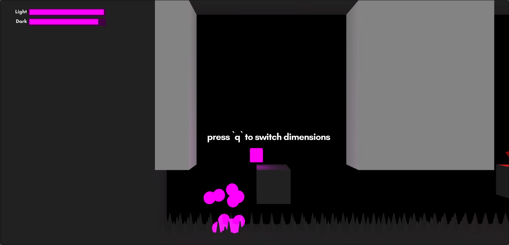
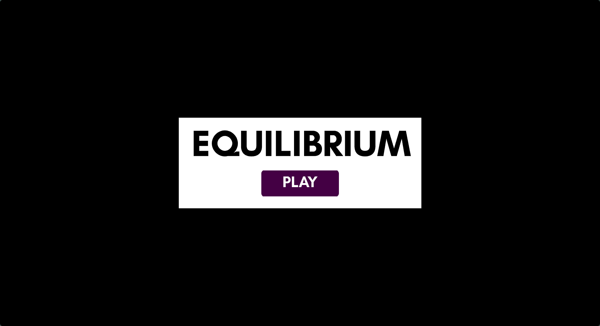
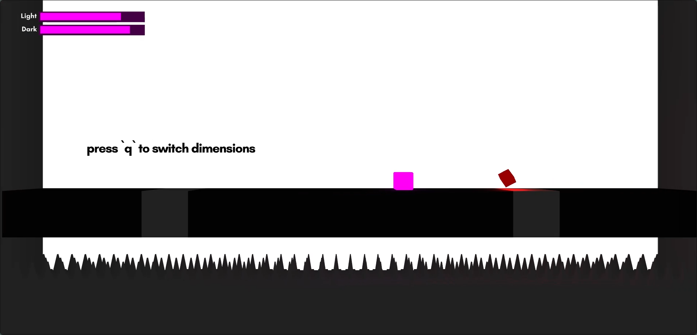
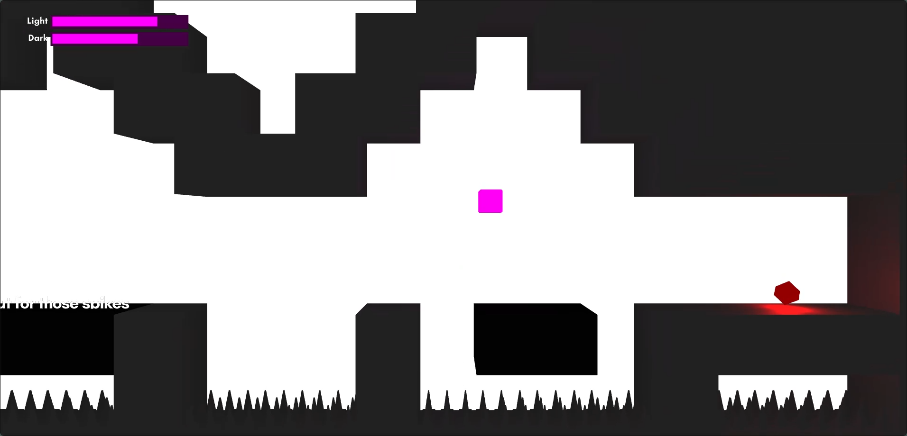
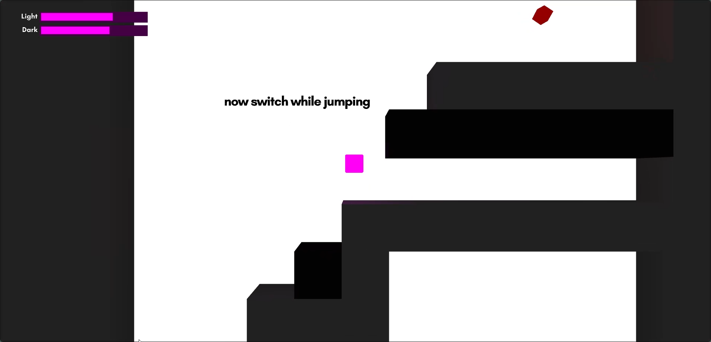
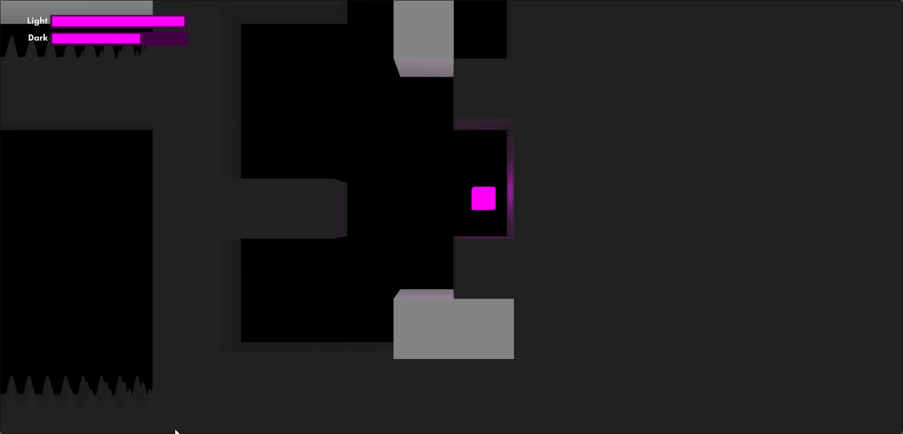
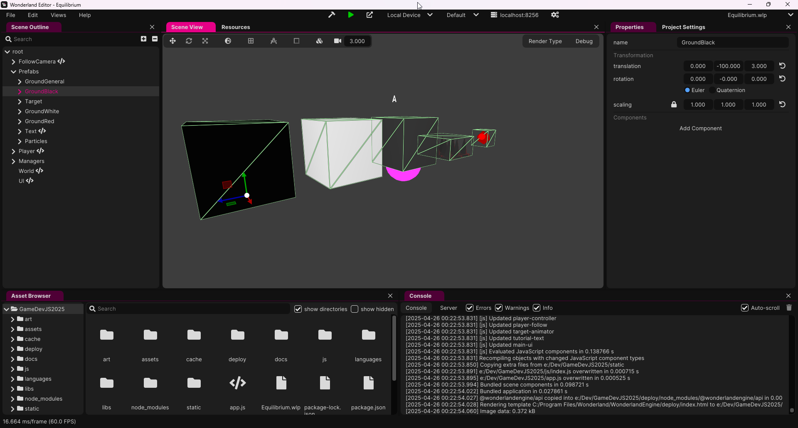
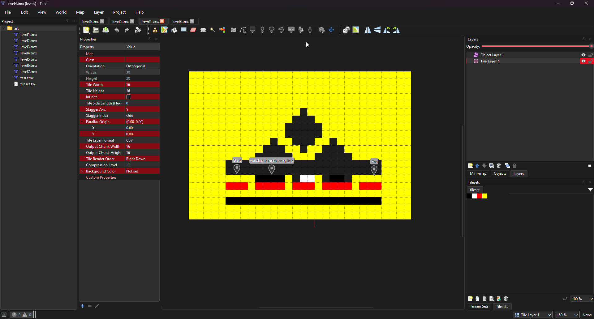

# Equilibrium


## About

Equilibrium is a Puzzle Platformer developed for the GameDevJS 2025 Game Jam.

<https://sorskoot.itch.io/equilibrium>



## How to Play

Try to navigate throught the level and reach the red crystal. Certain blocks are only visible in the light or dark dimensions. You have a limited amount of energy to stay in the light or dark dimensions. Balance the use of the energy by switching dimensions

- Use arrow keys or A/D to move left and right
- Use space to jump
- Use `Q` to switch dimensions

## Features

- Built with Wonderland Engine and TypeScript
- Wonderland React-UI for UI components

## Technology

This game is built using:

- **Wonderland Engine** - A WebXR framework for creating 3D/XR experiences - [WonderlandEngine.com](https://wonderlandengine.com/)
- **TypeScript** - For type-safe, maintainable code
- **Custom React Implementation** - For UI components using Wonderland React-UI
- **ESBuild** - For fast, efficient builds
- **Tiled** - For designing the levels - [MapEditor.org](https://www.mapeditor.org/)

## Installation

1. Clone the repository:

```npm
git clone https://github.com/sorskoot/GameDevJS2025.git
```

2. Install dependencies:

```npm
npm install
```

3. Download Wonderland Engine

Go to [wonderlandengine.com](https://wonderlandengine.com/). Download the editor and install it.

4. Run

Open the project in the editor.

## Development

This project follows strict TypeScript conventions and custom Wonderland Engine patterns:

- OOP principles with proper encapsulation
- Optimized vector/quaternion usage for performance
- Component-based architecture

## Credits

- Developed by Sorskoot
- Created for GameDevJS 2025 Game Jam

## License

MIT

## Screenshots

**Game Logo**


**Gameplay**






**Wonderland Engine**


**Tiled**

