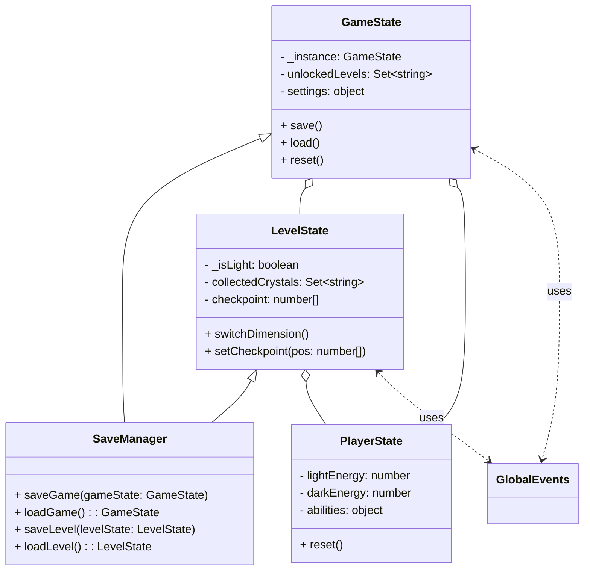
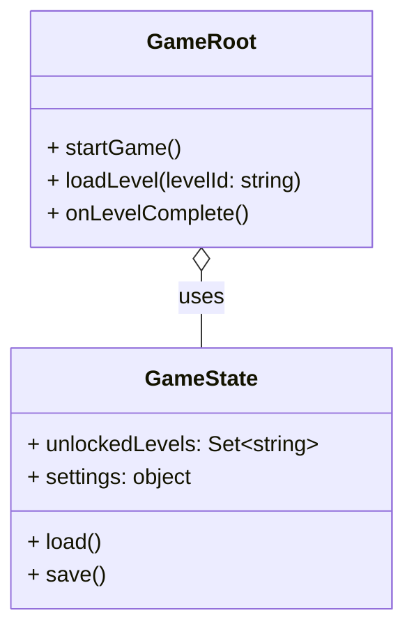

# Architecture

## **Core State Management Concepts**

### **1. State Layers**

- **Global Game State**  
  - Tracks overall progress, unlocked levels, settings, etc.
  - Singleton, persists across scenes/levels.
- **Level State**  
  - Tracks current level info: dimension, collectibles, player position, etc.
  - Reset/re-initialized on level load.
- **Session/Runtime State**  
  - Temporary, e.g., current score, temporary buffs, etc.

---

### **2. Suggested Classes/Singletons**

- **GameState**  
  - Singleton. Holds global progress, unlocked levels, settings, etc.
  - Handles save/load to localStorage or file.
- **LevelState**  
  - Tracks current dimension, collected crystals, checkpoint, etc.
  - Notifies components of changes (observer/event pattern).
- **PlayerState**  
  - Tracks player-specific info: energy, position, abilities.
- **SaveManager**  
  - Handles serialization/deserialization of GameState and LevelState.

---

### **3. Event System**

- Use a global event bus (already present as `GlobalEvents`) for communication between systems (e.g., level complete, player died, dimension switched).

---

### **4. Loading & Saving**

- On game start, load GameState from storage.
- On level load, initialize LevelState.
- On checkpoint or level complete, save progress.
- Use JSON for serialization.

---

## **Mermaid Diagram**

---

## **Example Flow**

1. **Game Start:**  
   - `GameState.load()` loads progress/settings.
   - Main menu shown.

2. **Level Load:**  
   - `LevelState` initialized/reset.
   - Level data loaded, player placed at checkpoint/start.

3. **During Play:**  
   - `LevelState` and `PlayerState` updated as player progresses.
   - Events dispatched for dimension switches, collectibles, deaths.

4. **Checkpoint/Level Complete:**  
   - `GameState` and `LevelState` saved via `SaveManager`.

5. **Game Over/Quit:**  
   - State saved.

---

## **Implementation Notes**

- Use the singleton pattern for `GameState` (see your `GameState`).
- Use observer/event pattern for state changes (already present with `GlobalEvents`).
- Store progress in browser localStorage or IndexedDB for web builds.
- Serialize only necessary data (avoid storing runtime-only objects).

---

## **Summary Table**

| State Type     | Scope         | Example Data                        | Persistence |
|----------------|--------------|-------------------------------------|-------------|
| GameState      | Global        | Unlocked levels, settings           | Yes         |
| LevelState     | Per-level     | Dimension, crystals, checkpoint     | Yes         |
| PlayerState    | Per-session   | Energy, position, abilities         | Optional    |

---

To implement robust state management for your Wonderland Engine game (with level loading, gameplay state, and save/load), follow these steps:

---

## 1. **Design State Classes**

- **GameState**: Singleton, tracks global progress, unlocked levels, and settings.
- **LevelState**: Tracks current level info (dimension, collectibles, checkpoint).
- **PlayerState**: Tracks player-specific info (energy, position, abilities).
- **SaveManager**: Handles serialization/deserialization of GameState and LevelState.

---

## 2. **Implement Singleton Pattern**

Use a static `instance` property and a private constructor for singletons.

---

## 3. **Use Wonderland Engine Events**

Use the global event system (`GlobalEvents`) to notify components of state changes (e.g., level complete, checkpoint reached).

---

## 4. **Saving and Loading**

- Use `localStorage` for browser builds.
- Serialize only necessary data (avoid runtime-only objects).
- Save on checkpoints, level complete, and game quit.

---

## 5. **Component Integration**

- Components should reference the singleton state classes.
- On `start`, validate required properties.
- Use event handlers for state changes.

---

## 6. **Example Mermaid Diagram**

---

## 7. **Next Steps**

- Scaffold the `GameState`, `LevelState`, `PlayerState`, and `SaveManager` classes.
- Integrate state access into your Wonderland components.
- Add event-driven updates for UI and gameplay logic.
- Implement save/load triggers at appropriate gameplay moments.

---
Great question!
**GameState** should be responsible for holding and managing global game data (progress, unlocked levels, settings, etc.) and providing methods to load/save this data.
However, it should **not** control the entire game flow or act as the "root" of your application.

### Recommended Architecture

- **GameState**:
  - Holds and manages global data.
  - Provides `load()` and `save()` methods.
  - Notifies other systems of changes (optionally via events).

- **GameRoot (or GameManager)**:
  - A singleton Wonderland Engine component.
  - Controls the main game flow: loading levels, switching scenes, responding to global events, etc.
  - Uses `GameState` for data, but does not store data itself.
  - Coordinates between `GameState`, `LevelState`, UI, and other systems.

---

#### **Summary Table**

| Class         | Responsibility                                    |
|---------------|---------------------------------------------------|
| GameState     | Store/load/save global data (progress, settings)  |
| GameRoot      | Control game flow, coordinate systems             |

---

#### **Example Usage**

- On game start, `GameRoot` calls `GameState.instance.load()`.
- When a level is completed, `GameRoot` updates `GameState` and triggers a save.
- UI and other systems read from `GameState` as needed.

---

#### **Mermaid Diagram**

---

**In summary:**

- `GameState` is for data.
- `GameRoot` (or similar) is for control/coordination.

Let me know if you want a scaffold for `GameRoot` or further details!
